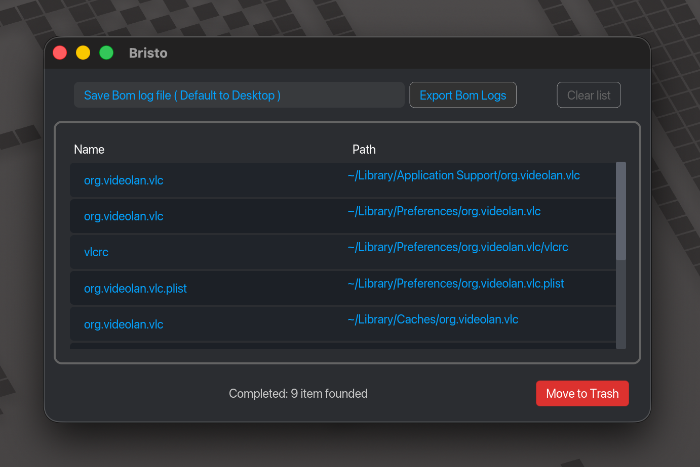

#  **BristApp**

## Screenshot

 

---

**BristApp** is a cleanup tool designed to safely remove applications and their associated files or folders from the macOS system.

This app was built using open-source components and inspired by privacy guides from **[Sunknudsen](https://github.com/sunknudsen/guides/tree/main/archive/how-to-clean-uninstall-macos-apps-using-appcleaner-open-source-alternative)**. Some of the scripts in this app adapt references from his guides, so I want to give him a big thank you!

The app’s interface is kept simple using Rust with gui using iced rs, with the main goal of helping my beloved wife and friends who rarely use the terminal on macOS.
On top of that, this project also serves as a way for me to dive deeper into Rust.

#### "Inspect and compile it"

---

## Permissions and Privacy Notice for macOS

To perform cleanup app effectively, **BristApp** requires specific permissions when running on macOS. Below is a detailed explanation:

### Access to Finder (Automation Permission)

BristApp interacts with Finder to:

**This permission is required.**

- Without this permission, BristApp cannot show files or folders in the finder.
- Without this permission, BristApp cannot kill process if application that need remove still running.
  This permission can be skipped but maybe that function will be failed and need to do manually.

**How to Grant Finder Access:**

1. Go to **System Preferences → Security & Privacy → Privacy → Automation**.
2. Ensure **BristApp** is allowed to control Finder.
3. Restart the application after granting this permission.

### Access to Full Disk (Full Disk Access Permission)

BristApp interacts with **~/Library/Container** where this protected by TCC in Mac System,

**This permission is required.**  
Without this permission, BristApp cannot move files or folders inside **~/Library/Container** to the Trash.
This permission can be skipped but for folder or file inside **~/Library/Container** need to delete manually.

**How to Grant Full Disk Access:**

1. Go to **System Preferences → Security & Privacy → Privacy → Full Disk Access**.
2. Ensure **BristApp** in the list and enabled.
3. Restart the application after granting this permission.

#### Inspect the code for more information and to know what the code doing and trigger Permission and Privacy.

---

## How to Use BristApp

BristApp makes cleaning up applications simple and intuitive. Follow these steps:

### Selecting an Application

- **Drag & Drop**: Drag the application you want to clean into the BristApp window.
- **Export Bom Logs**: Use to export bom logs file, it can be use for more advanced inspection manually (you can watch Sunknudsen explain).

---

### Displaying Related Files or Folders

Once an application is selected, BristApp will display a list of related files or folders.

- **Delete All**: Click the **Move to Trash** button to move all files/folders to the Trash.

---

### Verifying Deleted Files

Files or folders moved to the **Trash** can be reviewed. If needed, you can restore them to their original location.

---

### Opening File/Folder Locations

To open the location of a file or folder:

- **click** on the item in the path list name.

---

### Searching for Log Files (BOM File Log)

BristApp can also search for log files to help with more thorough cleanup.

- **Default Location**: Log files are automatically saved to the **Desktop** but can be replace in input field.

---

## License

Licensed under either of:

- Apache License, Version 2.0 (LICENSE-APACHE or http://www.apache.org/licenses/LICENSE-2.0)

- MIT license (LICENSE-MIT or http://opensource.org/licenses/MIT)

at your option.

---

## Contributing

Contributions are welcome! If you'd like to improve BristApp or add new features, please open an issue or submit a pull request.

---

## Need Help?

If you experience issues or have questions, please check the **[Wiki](https://github.com/ziprangga/bristapp/wiki)** or open an issue.
